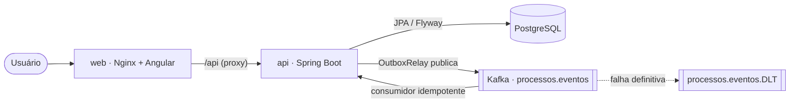
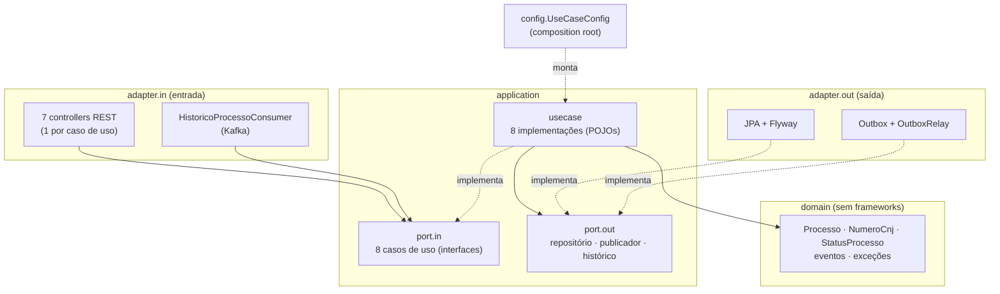
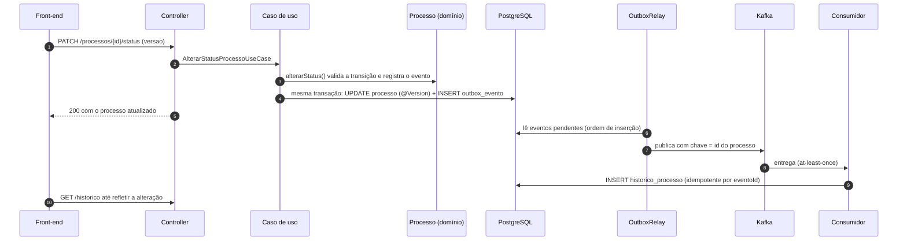

# Processos — gestão de processos judiciais

Aplicação ponta a ponta para uma procuradoria cadastrar e acompanhar processos judiciais: **front-end Angular**, **API Spring Boot** em arquitetura hexagonal, **PostgreSQL** e **Kafka** para a linha do tempo assíncrona de cada processo.

> Teste técnico — Attus Procuradoria Digital. As decisões de projeto, trade-offs e melhorias futuras estão em [DECISIONS.md](DECISIONS.md).

---

## Sumário

- [Como executar](#como-executar)
- [Roteiro rápido de avaliação](#roteiro-rápido-de-avaliação)
- [O que a aplicação faz](#o-que-a-aplicação-faz)
- [Arquitetura](#arquitetura)
- [API](#api)
- [Observabilidade e diagnóstico](#observabilidade-e-diagnóstico)
- [Testes e qualidade](#testes-e-qualidade)
- [Desenvolvimento local (opcional)](#desenvolvimento-local-opcional)
- [Stack](#stack)

---

## Como executar

**Único pré-requisito: [Docker](https://docs.docker.com/get-docker/) com Docker Compose.** Não é preciso instalar Java, Maven, Node ou Angular CLI — tudo é compilado dentro dos containers.

```bash
git clone https://github.com/FelipePrado97/attustest.git
cd attustest
docker compose up -d --build
```

A primeira execução baixa as imagens e dependências (alguns minutos). Quando terminar:

| O quê | Endereço |
|---|---|
| **Aplicação (front-end)** | http://localhost:4200 |
| Documentação da API (Swagger) | http://localhost:8080/swagger-ui.html |
| Health check | http://localhost:8080/actuator/health |
| Métricas do outbox | http://localhost:8080/actuator/metrics/outbox.eventos.pendentes |

Para acompanhar os logs da API:

```bash
docker logs -f attus-api
```

Para inspecionar as mensagens do Kafka (tópicos `processos.eventos` e `processos.eventos.DLT`) em http://localhost:8090:

```bash
docker compose --profile tools up -d kafka-ui
```

Para encerrar (use `-v` para apagar também os dados do banco):

```bash
docker compose down
```

### Serviços do `docker-compose.yml`

| Serviço | Porta | Papel |
|---|---|---|
| `web` | 4200 | Angular servido pelo Nginx, que também faz proxy de `/api` para a API (mesma origem, sem CORS) |
| `api` | 8080 | Spring Boot (Java 21) |
| `postgres` | 5432 | PostgreSQL 17 — schema criado pelas migrations do Flyway |
| `kafka` | 9092 | Kafka 4 em modo KRaft (sem Zookeeper) |
| `kafka-ui` | 8090 | Opcional (profile `tools`) |
| `backend-test` / `frontend-test` | — | Opcionais (profile `test`) — executam as suítes de teste |

---

## Roteiro rápido de avaliação

1. Abra http://localhost:4200 e clique em **Novo processo**.
2. No campo *Número CNJ*, clique no ícone ✨ para **gerar um número válido** (ou digite um que você já tenha — a máscara é aplicada enquanto você digita e o dígito verificador é conferido na hora).
3. Preencha o restante. Na *Data de distribuição*, digite só os números ou use o **calendário**: ele só permite datas entre 1º de janeiro do ano do CNJ e hoje.
4. Salve. Na tela de detalhe, a **linha do tempo** recebe o evento de cadastro em cerca de 1 segundo — ele percorre `banco → outbox → Kafka → consumidor → histórico`.
5. Clique em **Suspender**, depois **Reativar** e **Arquivar**: só as transições permitidas aparecem, e cada uma entra na linha do tempo. Um processo arquivado não pode ser editado.
6. **Conflito de edição:** abra o mesmo processo em duas abas, edite e salve em uma; ao salvar na outra, a aplicação avisa que o processo foi alterado por outro usuário e oferece *Recarregar*.
7. Na lista, busque pelo número **sem máscara** (ex.: `0001234712024`), por trecho do assunto ou da parte contrária, e filtre por status. O filtro fica na URL: recarregar ou compartilhar o link mantém o resultado.
8. Force um erro (ex.: CNJ com dígito errado direto no Swagger) e veja o `correlationId` na resposta; procure esse id com `docker logs attus-api | grep <id>` para ver toda a trajetória da requisição.

---

## O que a aplicação faz

**Domínio:** processos judiciais de uma procuradoria.

| Recurso | Regras |
|---|---|
| **Número CNJ** | Formato `NNNNNNN-DD.AAAA.J.TR.OOOO` (Resolução CNJ nº 65/2008) com **dígito verificador** (ISO 7064, módulo 97). Aceito com ou sem máscara, armazenado sempre formatado, único e imutável. |
| **Assunto / parte contrária** | Obrigatórios, até 200 / 150 caracteres. |
| **Valor da causa** | Maior ou igual a zero, no máximo 2 casas decimais (é rejeitado, nunca arredondado em silêncio) e até 13 dígitos inteiros. |
| **Data de distribuição** | Não anterior a 01/01/1900, **não anterior ao ano de ajuizamento** indicado no próprio CNJ (segmento `AAAA`) e não futura (fuso de Brasília). |
| **Status** | `ATIVO → SUSPENSO / ARQUIVADO`, `SUSPENSO → ATIVO / ARQUIVADO`, `ARQUIVADO → ATIVO` (desarquivamento). Arquivado não pode ser editado. |
| **Concorrência** | Controle otimista: toda alteração envia a `versao` lida; se outro usuário alterou antes, a API responde `409`. |
| **Linha do tempo** | Cadastro, edição, mudança de status e exclusão geram eventos de domínio, publicados no Kafka e registrados de forma assíncrona. O histórico é mantido mesmo após a exclusão (auditoria). |

### Telas

- **Lista** — busca livre (CNJ com ou sem máscara, assunto, parte), filtro por status, paginação; estado na URL.
- **Cadastro / edição** — validações imediatas espelhando as do backend, gerador de CNJ, máscaras, calendário, erros do servidor exibidos no campo correspondente.
- **Detalhe** — dados, ações de status permitidas, exclusão com confirmação e linha do tempo que se atualiza sozinha até refletir a última alteração.

---

## Arquitetura

### Visão geral



### Backend — arquitetura hexagonal (ports & adapters)



As dependências apontam sempre para dentro: o **domínio** não conhece Spring, JPA, HTTP nem Kafka; a **aplicação** só conhece o domínio e as próprias portas; os **adapters** dependem das portas, nunca das implementações. Essas regras são **verificadas automaticamente** pelo [`ArquiteturaHexagonalTest`](backend/src/test/java/br/com/attus/processos/ArquiteturaHexagonalTest.java) (ArchUnit) — uma violação quebra o build.

```
backend/src/main/java/br/com/attus/processos
├── domain                  regras de negócio puras
│   ├── model               Processo (agregado), NumeroCnj (value object), StatusProcesso (máquina de estados)
│   ├── event               ProcessoEvento, TipoEvento
│   └── exception           hierarquia selada: DadoInvalido, RecursoNaoEncontrado, Conflito, RegraNegocio
├── application
│   ├── port.in             um contrato por caso de uso (CadastrarProcessoUseCase, ...)
│   ├── port.out            ProcessoRepositoryPort, PublicadorEventosPort, HistoricoRepositoryPort
│   └── usecase             implementações (CadastrarProcessoService, ...) + ProcessoCarregador, ProcessoPersistencia
├── adapter
│   ├── in.web              controllers, DTOs, ApiExceptionHandler (RFC 9457), CorrelationIdFilter
│   ├── in.messaging        consumidor Kafka da linha do tempo
│   ├── out.persistence     entidades JPA, specifications, tradução de erros de banco para o domínio
│   └── out.messaging       outbox, relay para o Kafka, limpeza e métricas
├── config                  UseCaseConfig (composition root), Kafka, OpenAPI, Clock
└── shared                  CorrelationId
```

### Fluxo de uma alteração



### Front-end

```
frontend/src/app
├── core                    transversal: erro da API, interceptor de correlação, notificações,
│                           diálogo de confirmação, máscara, datas e adapter do calendário pt-BR
└── processos
    ├── lista · formulario · detalhe       telas (carregadas sob demanda)
    ├── ui                                  status-chip, linha do tempo
    ├── validacao                           validadores e mensagens (espelham o backend)
    ├── cnj.ts                              máscara, dígito verificador e gerador de CNJ
    └── processo-api.ts                     cliente HTTP
```

Angular 22 com componentes standalone, signals, `OnPush` e rotas lazy; Angular Material para os componentes visuais.

---

## API

Base: `http://localhost:8080/api/v1/processos` — documentação interativa completa no **Swagger** (http://localhost:8080/swagger-ui.html).

| Método | Rota | Descrição | Respostas |
|---|---|---|---|
| `GET` | `/processos?termo=&status=&pagina=0&tamanho=10` | Lista com busca e filtro (mais recentes primeiro) | 200, 400 |
| `GET` | `/processos/{id}` | Detalhe | 200, 404 |
| `POST` | `/processos` | Cadastro (nasce `ATIVO`) | 201 + `Location`, 400, 409 |
| `PUT` | `/processos/{id}` | Edição (exige `versao`) | 200, 400, 404, 409, 422 |
| `PATCH` | `/processos/{id}/status` | Mudança de status (exige `versao`) | 200, 400, 404, 409, 422 |
| `DELETE` | `/processos/{id}` | Exclusão (o histórico é mantido) | 204, 404, 409 |
| `GET` | `/processos/{id}/historico` | Linha do tempo (mais recente primeiro) | 200 |

Exemplo de cadastro:

```bash
curl -X POST http://localhost:8080/api/v1/processos \
  -H "Content-Type: application/json" \
  -d '{"numeroCnj":"0001234-71.2024.8.26.0100","assunto":"Execucao fiscal - IPTU 2021","parteContraria":"Empresa Exemplo Ltda","valorCausa":15230.50,"dataDistribuicao":"2024-03-15"}'
```

### Erros

Todos os erros seguem o **Problem Details (RFC 9457)** e trazem o `correlationId` da requisição:

```json
{
  "status": 400,
  "title": "Bad Request",
  "detail": "Número CNJ com dígito verificador inválido",
  "instance": "/api/v1/processos",
  "correlationId": "3f2b8c1e-9a7d-4c1b-8e2f-0a1b2c3d4e5f",
  "erros": [{ "campo": "numeroCnj", "mensagem": "Número CNJ com dígito verificador inválido" }]
}
```

| Status | Quando |
|---|---|
| 400 | Dados inválidos (validação da requisição ou invariante do domínio), com a lista `erros` por campo |
| 404 | Processo não encontrado |
| 409 | Número CNJ já cadastrado ou versão desatualizada (outro usuário alterou antes) |
| 422 | Operação proibida pelo estado do processo (transição inválida, processo arquivado) |
| 500 | Erro inesperado — mensagem genérica, sem detalhes internos; o stack trace fica no log, localizável pelo `correlationId` |

---

## Observabilidade e diagnóstico

- **Correlation id ponta a ponta:** o front envia `X-Correlation-Id` em cada chamada (ou a API gera um). O id vai para o MDC, aparece em **todas as linhas de log** (`[cid:...]`), é gravado no outbox, viaja no header da mensagem Kafka e é restaurado no consumidor — a mesma operação é rastreável do clique até o histórico. Ele também volta em toda resposta de erro.
- **Log de acesso** por requisição: método, rota, status e duração.
- **Métricas** (`/actuator/metrics` e `/actuator/prometheus`): `outbox.eventos.pendentes` (crescendo sem parar indica broker fora ou relay parado) e `outbox.eventos.com.falha` (maior que zero indica evento que exige investigação).
- **Dead Letter Topic** `processos.eventos.DLT`: mensagens que não puderam ser processadas, com o motivo nos headers — nada é perdido e a fila não trava.
- **Health checks** de liveness e readiness no Actuator.

---

## Testes e qualidade

Rodando **só com Docker** (nenhuma instalação necessária):

```bash
docker compose --profile test run --rm backend-test
```

```bash
docker compose --profile test run --rm frontend-test
```

| | Backend | Front-end |
|---|---|---|
| Testes | **185** (JUnit 5) | **170** (Vitest) |
| Cobertura de linhas | 100% | 98,5% |
| Cobertura de branches | 92,8% | 96,2% |
| Trava no build | falha abaixo de 90% linhas / 85% branches (JaCoCo) | falha abaixo de 90% linhas / 85% branches |
| Relatório | `backend/target/site/jacoco/index.html` | `frontend/coverage/frontend/index.html` |

**Backend**
- **Domínio** — testes unitários puros das regras (CNJ, transições, valores, datas).
- **Casos de uso** — cada serviço isolado com Mockito.
- **Controllers** — `@WebMvcTest` por controller: contrato HTTP, validação, mapeamento de erros, correlation id.
- **Persistência** — `@DataJpaTest` contra as migrations reais: filtros, busca sem máscara, curingas do `LIKE`, paginação estável, tradução de erros de banco.
- **Mensageria** — relay do outbox (ordem, bloqueio por processo, backoff, broker fora), consumidor, limpeza e métricas.
- **Integração ponta a ponta** — `@SpringBootTest` com H2 (modo PostgreSQL) e **Kafka embarcado**: HTTP → banco → outbox → Kafka → consumidor → histórico, DLT, concorrência real entre duas edições simultâneas.
- **Arquitetura** — ArchUnit garante as fronteiras hexagonais.

**Front-end**
- Validadores, máscaras, CNJ e datas (funções puras); cliente HTTP e interceptor (`HttpTestingController`); tradução de erros; componentes das três telas com navegação real (`RouterTestingHarness`) e harnesses do Angular Material.

---

## Desenvolvimento local (opcional)

Para depurar pela IDE, com **JDK 21** e **Node 22 LTS** instalados:

```bash
docker compose up -d postgres kafka
```

```bash
cd backend && ./mvnw spring-boot:run
```

```bash
cd frontend && npm ci && npm start
```

O front sobe em http://localhost:4200 com proxy de `/api` para `http://localhost:8080` (configurável pela variável `API_URL`, definida em `frontend/proxy.conf.js`).

Os testes do backend não precisam de Docker (`./mvnw verify` usa H2 e Kafka embarcado); os do front rodam com `npx ng test --watch=false --coverage`.

---

## Stack

| Camada | Tecnologias |
|---|---|
| Back-end | Java 21, Spring Boot 4.1, Spring Web MVC, Spring Data JPA / Hibernate 7, Bean Validation, Flyway, Spring for Apache Kafka, Actuator + Micrometer, springdoc-openapi |
| Front-end | Angular 22 (standalone, signals, zoneless), Angular Material 22, RxJS, TypeScript 6 |
| Dados e mensageria | PostgreSQL 17, Apache Kafka 4 (KRaft) |
| Testes | JUnit 5, Mockito, AssertJ, Awaitility, H2, Kafka embarcado, ArchUnit, JaCoCo; Vitest, jsdom |
| Infraestrutura | Docker (builds multi-stage, execução sem root), Docker Compose, Nginx |
